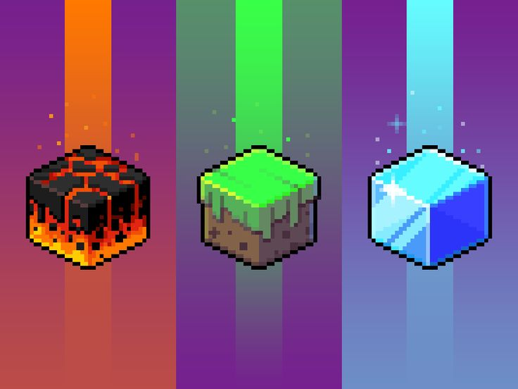

# Cub3D - 42 Project

**Cubed** es un juego 3D basado en el concepto de raycasting, creado como parte del proyecto de la escuela 42. En este juego, el jugador navega por un mundo en 3D utilizando rayos para detectar las paredes y las texturas, con el objetivo de explorar y interactuar con su entorno.

## Participantes

- **legrol** - [GitHub Profile](https://github.com/rdel-olm](https://github.com/legrol)
- **drosales96** - [GitHub Profile](https://github.com/drosales](https://github.com/drosales96)

---

## Objetivo del Proyecto

El propósito del proyecto **Cubed** es desarrollar un motor de juego en 3D funcional utilizando el algoritmo de **raycasting**. Este enfoque se inspira en clásicos como *Wolfenstein 3D*, donde el renderizado en 3D se logra simulando perspectivas en tiempo real dentro de un entorno 2D. A diferencia de motores gráficos modernos como Unity o Unreal Engine, este proyecto busca explorar conceptos fundamentales de programación gráfica desde cero, lo que incluye el manejo directo de píxeles, texturas y geometría.

---

## Objetivos Específicos

### Renderizado en 3D mediante Raycasting:
- Implementar un motor gráfico que utiliza raycasting para calcular la distancia a las paredes del entorno y renderizar la escena en perspectiva.
- Simular la percepción de profundidad mediante el escalado de las paredes en función de la distancia al jugador.

### Creación de Mapas Personalizados:
- Diseñar un sistema que permita a los usuarios cargar mapas personalizados desde un archivo de texto.
- Interpretar mapas 2D (matrices de caracteres) como mundos en 3D, donde cada símbolo representa un elemento del entorno (paredes, suelo, espacios vacíos, etc.).
- Asegurar que el sistema sea extensible para admitir diferentes configuraciones y diseños.

### Interacción con Texturas y Colores:
- Implementar la carga y asignación de texturas en formato `.xpm` para paredes, suelo y cielo.
- Crear un sistema para interpretar colores codificados, permitiendo la personalización de elementos visuales como el cielo y el suelo.
- Garantizar que las texturas se muestren correctamente escaladas y alineadas con las paredes, independientemente de la perspectiva del jugador.

### Simulación de Movimiento y Física Básica:
- Permitir al jugador moverse por el entorno utilizando controles de teclado (como **WASD**) y ajustar su campo de visión mediante la rotación de la cámara.
- Detectar colisiones con las paredes para evitar que el jugador salga del mapa o atraviese objetos sólidos.

### Optimización del Rendimiento:
- Asegurar que el motor sea eficiente al renderizar cada fotograma, minimizando los cálculos redundantes durante el ciclo del juego.
- Utilizar algoritmos optimizados para el trazado de rayos y la gestión de memoria.

### Gestión de Eventos y Entradas del Jugador:
- Implementar un sistema para manejar eventos del teclado y del ratón, adaptando el movimiento y la interacción en tiempo real.
- Garantizar una experiencia de usuario fluida y receptiva.
