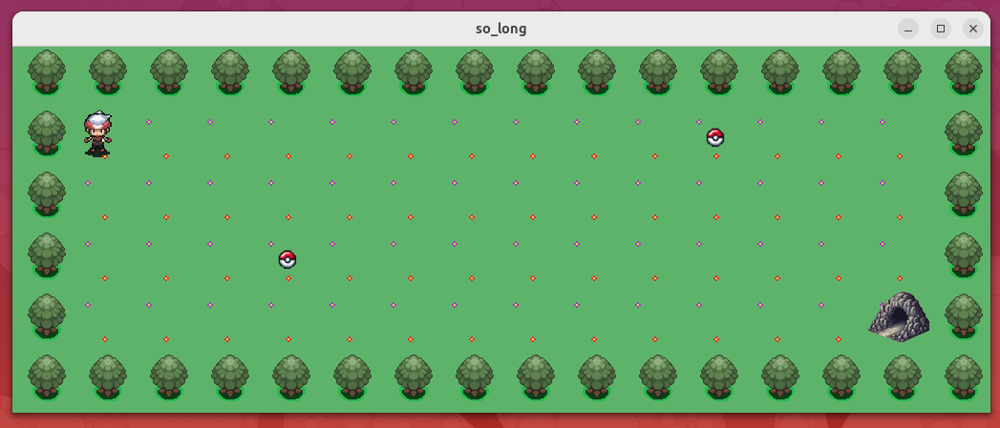
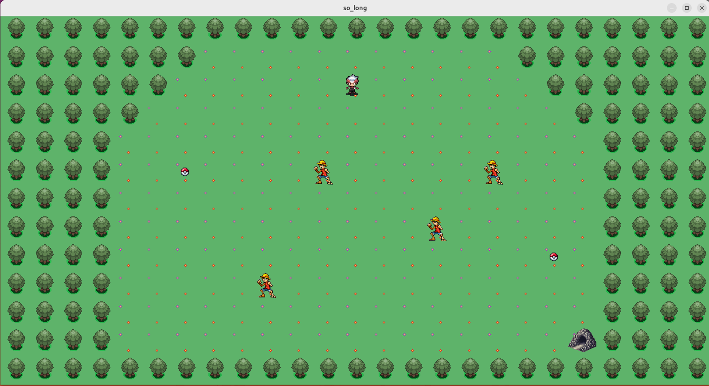

# 🎮 Proyecto So_long

¡Bienvenidos al mundo de **So_long**! 🌟 Este proyecto es una humilde simulación de un juego de Pokémon, donde los jugadores pueden explorar un mundo lleno de aventuras. Sin embargo, en lugar de los clásicos enemigos, te enfrentarás a un sprite de **One Piece** 🏴‍☠️ para obtener la **nota bonus**. ¡Una mezcla única de universos que no querrás perderte!

## 🚀 Compilación del Proyecto

Si deseas compilar el juego en tu propia terminal, sigue estos sencillos pasos:

1. **Clona el repositorio**:
   ```bash
   git clone https://github.com/tu-usuario/so_long.git
   cd so_long

```
make

make bonus

./so_long_bonus maps/map_bonus2.ber
               o
./so_long maps/maping2.ber
```

## 🎮 Ejecución del Juego

Si prefieres probar el juego directamente, he incluido los archivos ejecutables (`.exe`) en el repositorio. Simplemente ejecútalos y sumérgete en la aventura.

## 💡 Notas

- Este juego es una excelente manera de practicar programación y disfrutar de un juego clásico con un toque divertido.
- ¡No dudes en explorar y descubrir todos los secretos que **So_long** tiene para ofrecer!

## IMG



## IMG BONUS

